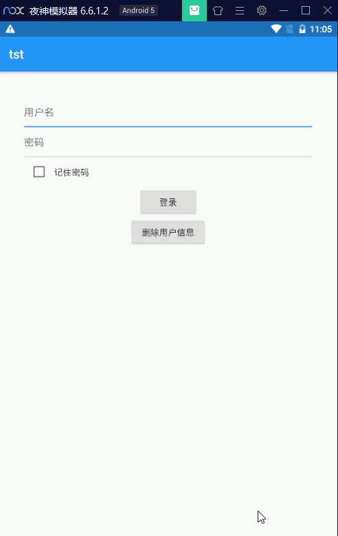

# flutter 记住密码 demo

## 效果图



## 依赖

```
shared_preferences: ^0.5.10
provider: ^4.3.2
```

## 功能

1、登录页面勾选“记住密码”后点击登录，登录成功保存用户名密码

2、登录页面，点击用户名输入框弹出已保存的用户名列表

3、用户名输入框输入字符实时变动显示已保存的用户名列表

4、点击用户名列表中某个用户名，自动输入用户名密码
